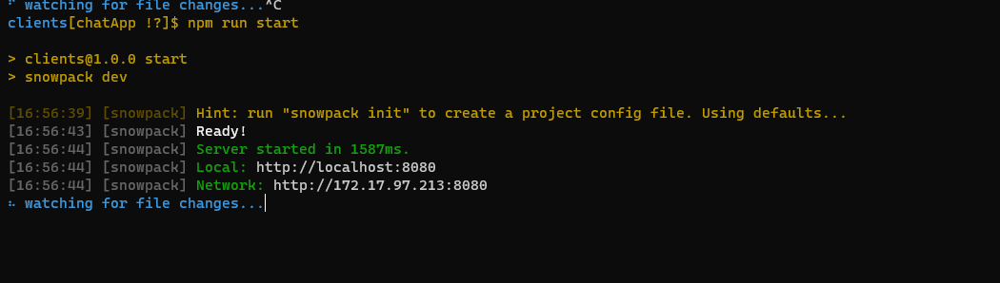
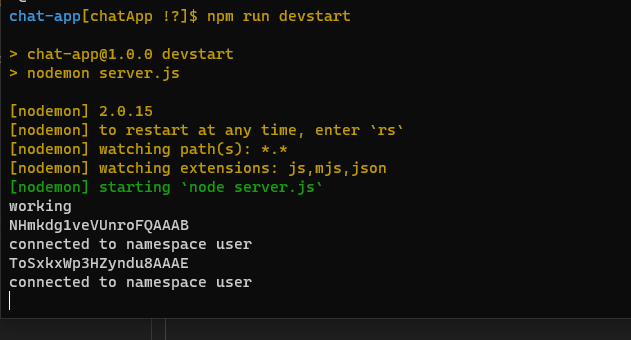
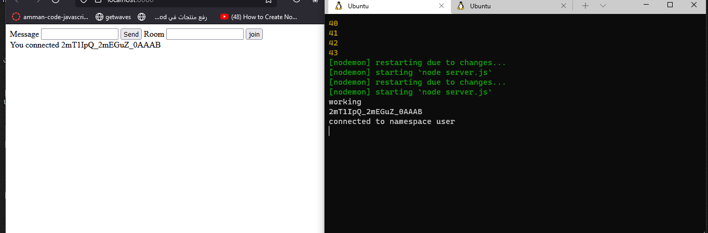
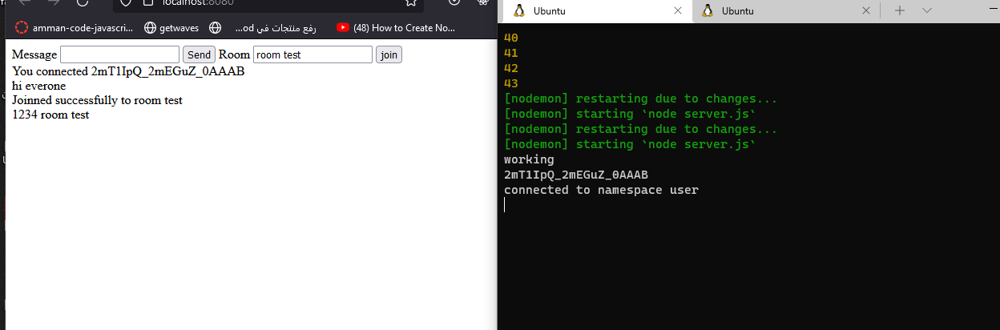
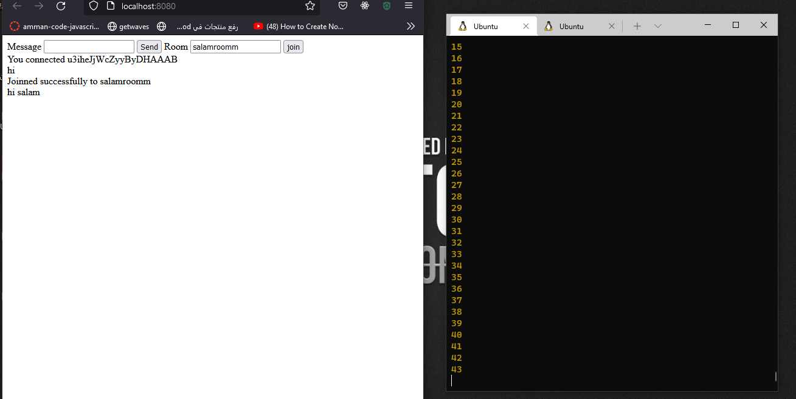
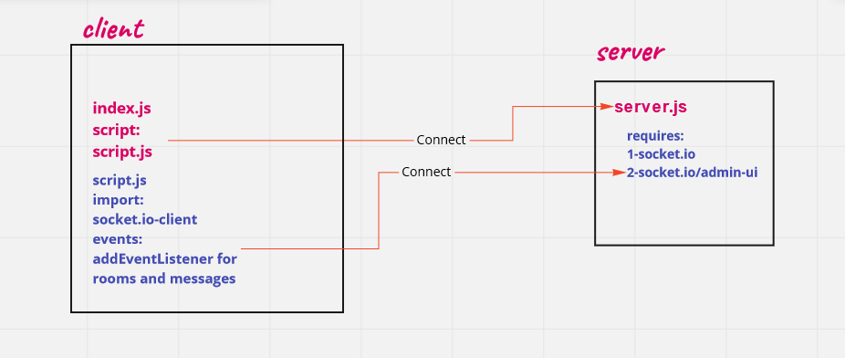

# chat-app

It's a simple chat ap chat between clients and you can join a specific room and send messages
its same as this video [Learn Socket.io In 30 Minutes](https://www.youtube.com/watch?v=ZKEqqIO7n-k&t=640s)
And it use socket.io to connect betwwen clients that connect to the server. 
And there's a namespace user to connect an auth middleware.

* [PR-link](https://github.com/salammustafa728/chat-app/pull/1)

The backages and dependencies I used:

* socket.io
* socket.io-client
* core-js
* cors
* snowpack for dev running in server and client [snowpack](https://www.snowpack.dev/tutorials/getting-started)
* @socket.io/admin-ui library and we use the socket.io admin ui website to view a dashboard that you can view a sokect.io stuff 

To run the code you should install the dependencies then

for the client side run **npm run devstart**

for the server run **npm run devstart**

# output

* 
* 
* 

# UML 

